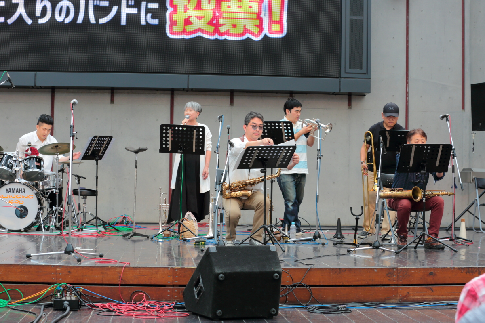
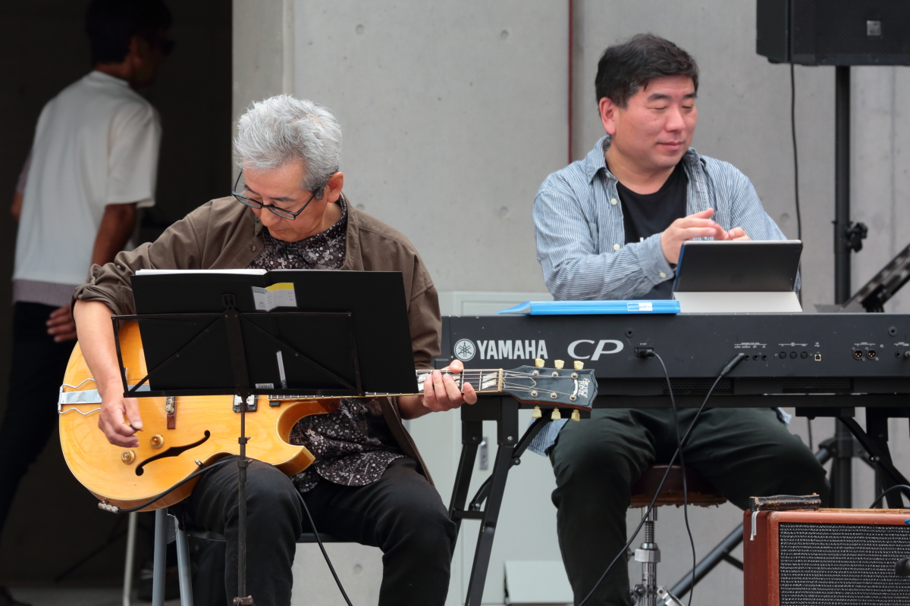
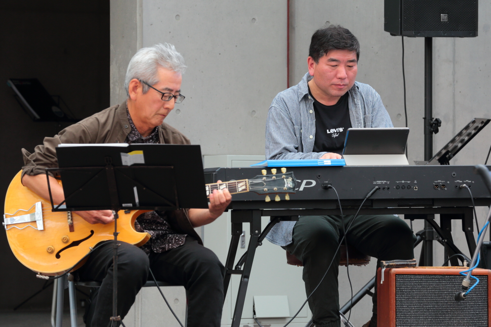
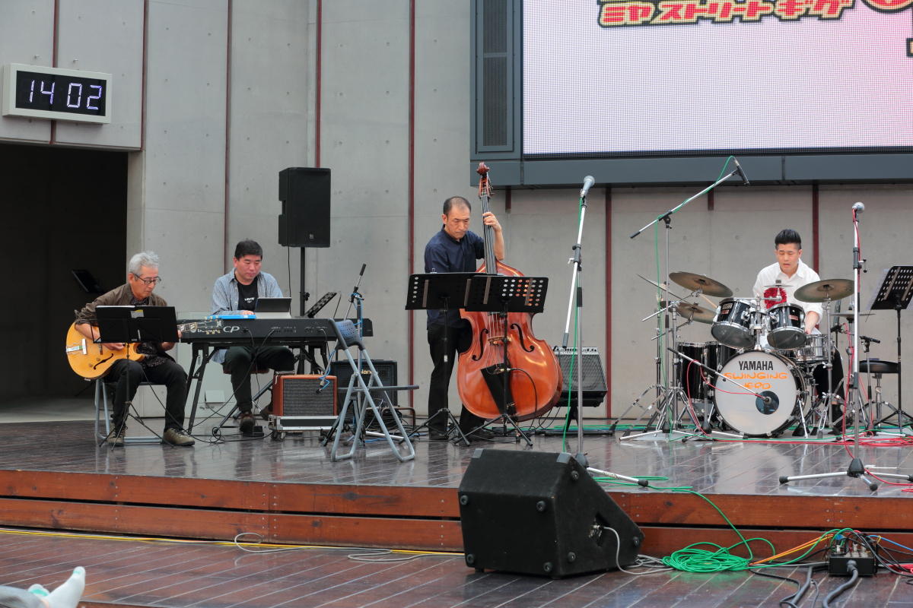
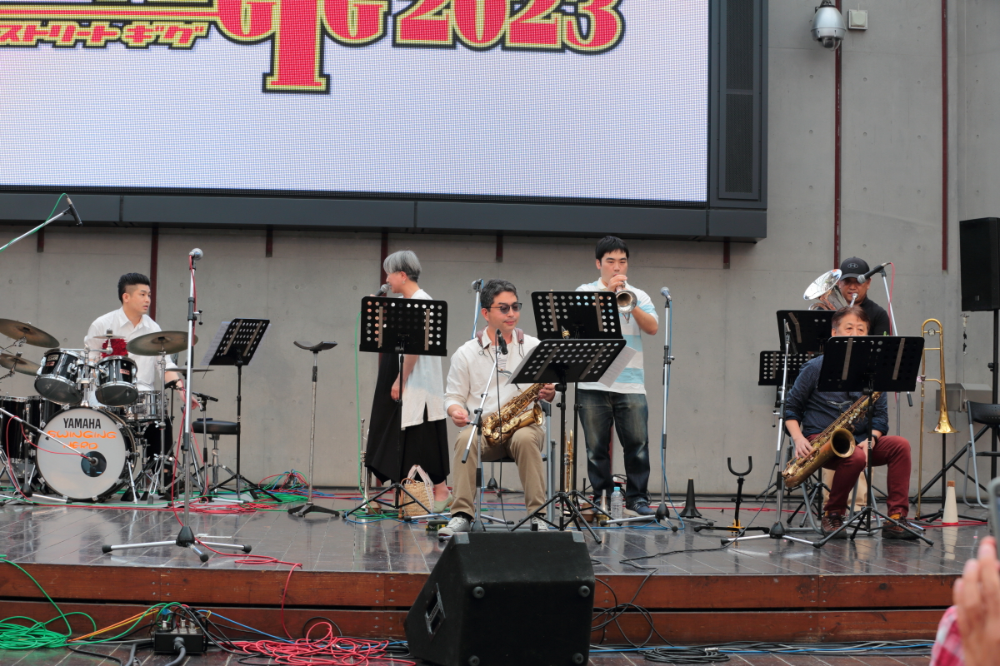
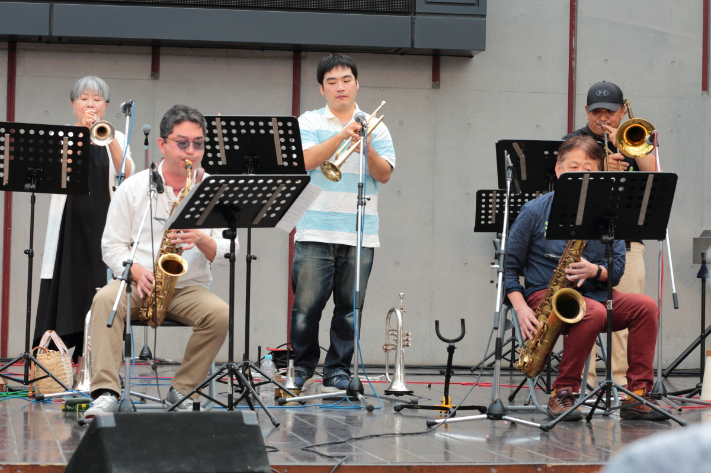
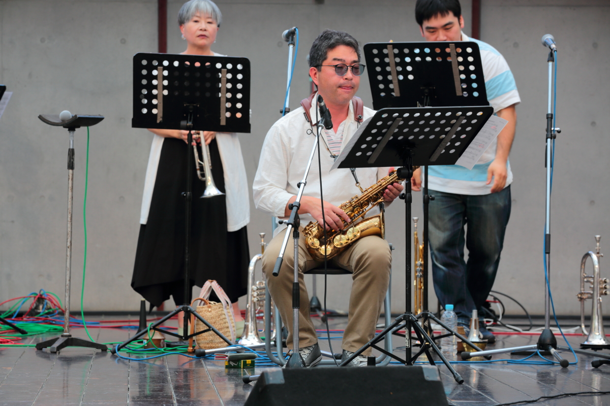

# miya_soreet_gig_2023
<html lang="ja">
 <head>
 <meta charset="UTF-8">
 <meta http-equiv="X-UA-Compatible" content="IE=EmulateIE10" />
 <title>miya street gig 2021</title>

<link href="https://cdnjs.cloudflare.com/ajax/libs/lightbox2/2.7.1/css/lightbox.css" rel="stylesheet">

</head>

<body onload="alert('MIYA STREER GIG 2023の写真と動画集です。来年もまた見せてね〜(^o^)/')">

  モバイル端末をお使いの場合は、画面を横向きにすると
  より見やすくご覧頂けます。

	

<a href="https://peyng.github.io/River-Jewelries-home/">Home</a>>miya street gig 2023

<h1><marquee behavior="left">!!! 2023年5月20日(土)_River Jewelries@宇都宮オリオンスクエア !!!</marquee></h1>
                               
 

	<h1>本番動画</h1>
	<h1>Gr紹介から一曲目演奏</h1>

<iframe width="560" height="315" src="https://www.youtube.com/embed/B9X_u1PbXx8" title="YouTube video player" frameborder="0" allow="accelerometer; autoplay; clipboard-write; encrypted-media; gyroscope; picture-in-picture; web-share" allowfullscreen></iframe>
	
<iframe width="560" height="315" src="https://www.youtube.com/embed/951vakI7dPw" title="YouTube video player" frameborder="0" allow="accelerometer; autoplay; clipboard-write; encrypted-media; gyroscope; picture-in-picture; web-share" allowfullscreen></iframe>
	
<iframe width="560" height="315" src="https://www.youtube.com/embed/26m9_JzieUc" title="YouTube video player" frameborder="0" allow="accelerometer; autoplay; clipboard-write; encrypted-media; gyroscope; picture-in-picture; web-share" allowfullscreen></iframe>
	
<iframe width="560" height="315" src="https://www.youtube.com/embed/a4ecfNK73Kc" title="YouTube video player" frameborder="0" allow="accelerometer; autoplay; clipboard-write; encrypted-media; gyroscope; picture-in-picture; web-share" allowfullscreen></iframe>
	
<iframe width="560" height="315" src="https://www.youtube.com/embed/6DJ7YnFBKik" title="YouTube video player" frameborder="0" allow="accelerometer; autoplay; clipboard-write; encrypted-media; gyroscope; picture-in-picture; web-share" allowfullscreen></iframe>
	
<iframe width="560" height="315" src="https://www.youtube.com/embed/W1zHSqt0dfk" title="YouTube video player" frameborder="0" allow="accelerometer; autoplay; clipboard-write; encrypted-media; gyroscope; picture-in-picture; web-share" allowfullscreen></iframe>
	

<h1>最後の曲演奏</h1>	
<iframe width="560" height="315" src="https://www.youtube.com/embed/4l4XVDX6N58" title="YouTube video player" frameborder="0" allow="accelerometer; autoplay; clipboard-write; encrypted-media; gyroscope; picture-in-picture; web-share" allowfullscreen></iframe>
	
 

<h1>演奏中のメンバー写真</h1>

   
<h1>お孫さんより、花束贈呈”</h1>

	

   

	<h1>パンフレット</h1>

 

       
       

&#160;

&#160;

&#160;

&#160;

&#160;

&#160;

&#160;

&#160;

&#160;

       
&#160;

&#160;

&#160;

&#160;

&#160;

&#160;

&#160;

&#160;

<marquee direction="left" scrollamount="10" width="80%">背景はMIYA STREET GIG パンフレット ~~~ (^^)/</marquee>

 

<!-- フッタ -->
 <footer>
	Copyright 2023/5/20 S.Hada
